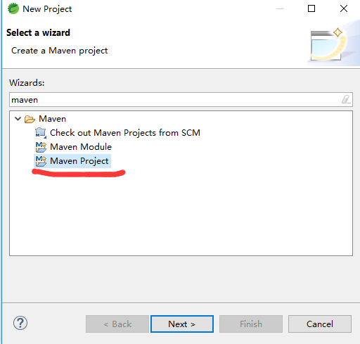
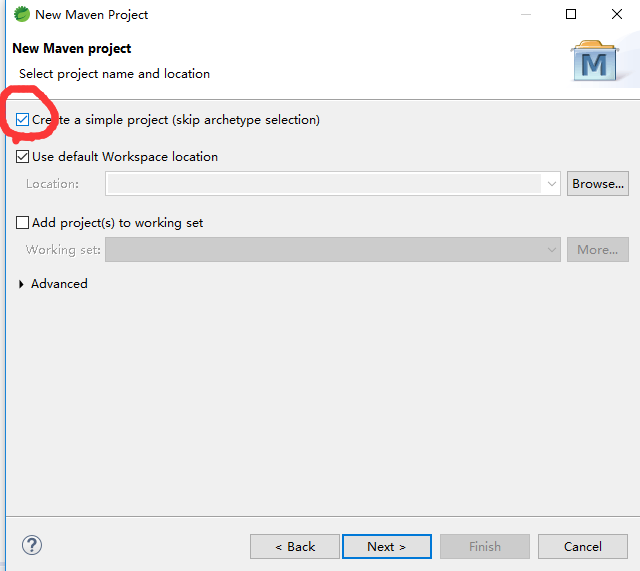
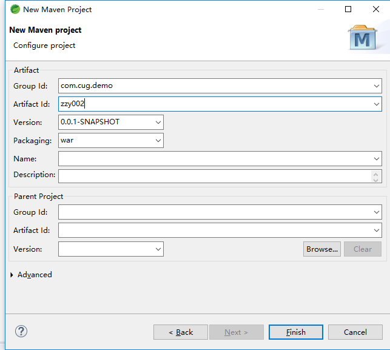
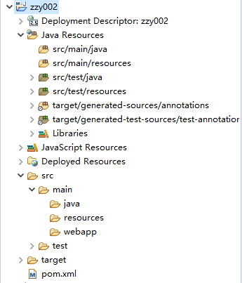
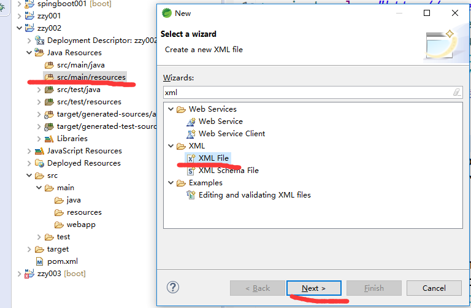
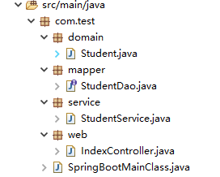
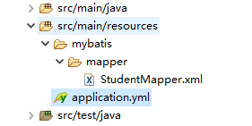

<h1>maven+springboot+mybatis对数据进行简单的增删察改</h1>
<h3>一、环境</h3>
eclipse_STS

<h3>二、建立项目及环境配置</h3>
1、新建maven项目








2、建好的项目好下图



这时文件目录并不完整，经过如下步骤可创建出web_info中的web.xml文件

:右键项目，找到java ee tools,点开，再找到generate Deployment discriptor crub,

点击即可。


3、向pom.xml中导入springboot ,mybatis等依赖

pom.xml

~~~java
<project xmlns="http://maven.apache.org/POM/4.0.0" xmlns:xsi="http://www.w3.org/2001/XMLSchema-instance" xsi:schemaLocation="http://maven.apache.org/POM/4.0.0 http://maven.apache.org/xsd/maven-4.0.0.xsd">
  <modelVersion>4.0.0</modelVersion>
  <groupId>com.online</groupId>
  <artifactId>spingboot001</artifactId>
  <version>0.0.1-SNAPSHOT</version>
    <!-- 继承SpringBoot官方指定的父工程 -->	
    <build>
    <plugins>
        <plugin>
            <groupId>org.springframework.boot</groupId>
            <artifactId>spring-boot-maven-plugin</artifactId>
        </plugin>
    </plugins>
</build>
<parent>
	<groupId>org.springframework.boot</groupId>
	<artifactId>spring-boot-starter-parent</artifactId>
	<version>1.5.8.RELEASE</version>
</parent>
<dependencies>
	<!-- 加入Web开发所需要的场景启动器 -->
	<dependency>
		<!-- 指定groupId和artifactId即可，版本已在父工程中定义 -->
		<groupId>org.springframework.boot</groupId>
		<artifactId>spring-boot-starter-web</artifactId>
	</dependency>
	<dependency>
			<groupId>mysql</groupId>
			<artifactId>mysql-connector-java</artifactId>
		</dependency>
		<dependency>
			<groupId>com.alibaba</groupId>
			<artifactId>druid</artifactId>
			<version>1.0.5</version>
		</dependency>
	<dependency>
			<groupId>org.mybatis.spring.boot</groupId>
			<artifactId>mybatis-spring-boot-starter</artifactId>
			<version>1.1.1</version>
		</dependency>
		<dependency>
			<groupId>junit</groupId>
			<artifactId>junit</artifactId>
			<scope>test</scope>
		</dependency>
		<dependency>
			<groupId>org.springframework.boot</groupId>
			<artifactId>spring-boot-starter-test</artifactId>
			<exclusions>
                <exclusion>
                    <groupId>com.vaadin.external.google</groupId>
                    <artifactId>android-json</artifactId>
                </exclusion>
            </exclusions>
		</dependency>
		<dependency>
			<groupId>org.apache.tomcat.embed</groupId>
			<artifactId>tomcat-embed-jasper</artifactId>
			<scope>provided</scope>
		</dependency>
		<dependency>
			<groupId>javax.servlet</groupId>
			<artifactId>jstl</artifactId>
		</dependency>
</dependencies>
</project>
~~~

复制之后点击保存，然后右键项目，找到maven，点击update project,或者直接alt+f5更新，一定要保存之后再更新，否则会没有反应。

更新后项目上就会出现springboot启动标志。

然后还需要配置springboot



在resources文件夹下新建Application.yml。eclipse里没有.yml文件，可以直接新建文件，后缀名为yml.

Application.yml

~~~java
spring:
  datasource:
    type: com.alibaba.druid.pool.DruidDataSource
    url: jdbc:mysql://127.0.0.1:3306/stu
    username: root
    password: 123456
    driver-class-name: com.mysql.jdbc.Driver
  mvc:
    view:
      prefix: /
      suffix: .jsp

mybatis:
  mapper-locations: classpath*:/mybatis/mapper/*Mapper.xml

~~~


 向其中添加一些数据库的配置。并指定mybatis的mapper文件。

4、配置好后，分别在以下文件夹建立文件



其中，web包代表web层,存放控制器，网页首先访问web层

domain放实体类，对应着数据库中的信息

mapper里存放实现方法的接口,也称dao

service层实现接口




然后在resources中建立以上目录。

```java
StudentMapper.xml中是对数据库的增删查改，帮助实现接口的功能。
```

Student.java

~~~java
package com.test.domain;

public class Student {
    private int id;
    private String name;
    private String password;
    private double grade;
	public int getID() {
		return id;
	}
	public void setID(int iD) {
		id = iD;
	}
	public String getName() {
		return name;
	}
	public void setName(String name) {
		this.name = name;
	}
	public String getPassword() {
		return password;
	}
	public void setPassword(String password) {
		this.password = password;
	}
	public double getgrade() {
		return grade;
	}
	public void setemail(double grade) {
		this.grade = grade;
	}
	@Override
	public String toString() {
		return "User[id="+id+",name="+name+",password="+password+",grade="+grade+"]";
	}
}

~~~


StudentDao.java

~~~java
package com.test.mapper;

import java.util.List;

import com.test.domain.Student;

public interface StudentDao {
    public List<Student> find();
}

~~~

StudentService.java

~~~java
package com.test.service;

import java.util.List;

import org.springframework.beans.factory.annotation.Autowired;
import org.springframework.stereotype.Service;
import org.springframework.transaction.annotation.Transactional;

import com.test.domain.Student;
import com.test.mapper.StudentDao;

@Service
@Transactional
public class StudentService implements StudentDao{
    @Autowired
	private StudentDao studentdao;
	@Override
	public List<Student> find() {
		List<Student> list = studentdao.find();
		System.out.println("++++++++++++++");
		return list;
	}
    
}

~~~

IndexController.java

~~~java
package com.test.web;

import java.util.List;

import org.springframework.beans.factory.annotation.Autowired;
import org.springframework.stereotype.Controller;
import org.springframework.web.bind.annotation.RequestMapping;
import com.test.domain.Student;
import com.test.service.StudentService;

@Controller
public class IndexController {
	@Autowired
	private StudentService studentservice;
    @RequestMapping("index")
	public String index() {
		return "index";
	}
    @RequestMapping("test")
    public String find() {
    	System.out.println("=================");
    	List<Student> list = studentservice.find();
    	System.out.println(list);
    	System.out.println("===============");
		return "index";
    }
}

~~~

SpringBootMainClass.java

~~~java
package com.test;

import org.mybatis.spring.annotation.MapperScan;
import org.springframework.boot.SpringApplication;
import org.springframework.boot.autoconfigure.SpringBootApplication;

@SpringBootApplication
@MapperScan(basePackages = "com.test.mapper")
public class SpringBootMainClass {
    public static void main(String[] args) {
    	SpringApplication.run(SpringBootMainClass.class, args);
    }
}

~~~

StudentMapper.xml

~~~java
<?xml version="1.0" encoding="UTF-8"?>
<!DOCTYPE mapper PUBLIC "-//mybatis.org//DTD Mapper 3.0//EN" "http://mybatis.org/dtd/mybatis-3-mapper.dtd">
<mapper namespace="com.test.mapper.StudentDao">
    <select id="find" resultType="com.test.domain.Student">
        select * from grade
    </select>
</mapper>
~~~

<hr>

<hr>

<h3>三、总结与注意事项</h3>
1、<!DOCTYPE mapper PUBLIC "-//mybatis.org//DTD Mapper 3.0//EN" "http://mybatis.org/dtd/mybatis-3-mapper.dtd">在Studentmapper.xml中的作用。

2、controller层和Service层在声明私有变量时要加@Autowired

3、@MapperScan(basePackages = "com.test.mapper")在main函数中指出mapper层路径。

<h3>四、思考

</h3>

@Override
	public String toString() {
		return "User[id="+id+",name="+name+",password="+password+",grade="+grade+"]";
	}

这名重写在实体类中的作用。


